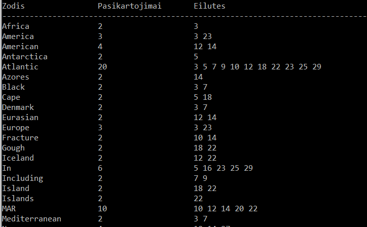

# Textfile analyser 
Ši programa nuskaito tekstas.txt failą, randa pasikartotinius žodžius, parašo kiek kartų pasikartoja ir kuriose eilutėse jie egzistuoja. (išrašo konsolėje bei atsakymas.txt faile)   
This program reads tekstas.txt textfile and find words and counts how many times it appeared in the text.  
**ARBA**  **OR**  
Programa nuskaito tekstas.txt failą ir randa URL linkus ir išrašo konsolėje bei atsakymas.txt faile  
The Program finds all URL links in the textfile Tekstas.txt  

Programa naudoja map, set STL konteinerius (taip pat ir vector)  
Programa naudoja biblioteką dirbti su failais (fstream, sstream)  
Programa naudoja std::string biblioteką

Program uses map, set, vector STLs, fstream, sstream and string libraries.

# NAUDOJIMOSI INSTRUKCIJA (UNIX) 
- 1: Repozitoriją atsisiųskite.
- 2: Konsolėje, įėję į programos aplankalą, parašykite `g++ -o main main.cpp` ir `./main`
- 2.1: Jeigu neturėtumėte g++ kompilerio, konsolėje parašykite `sudo apt install g++`
